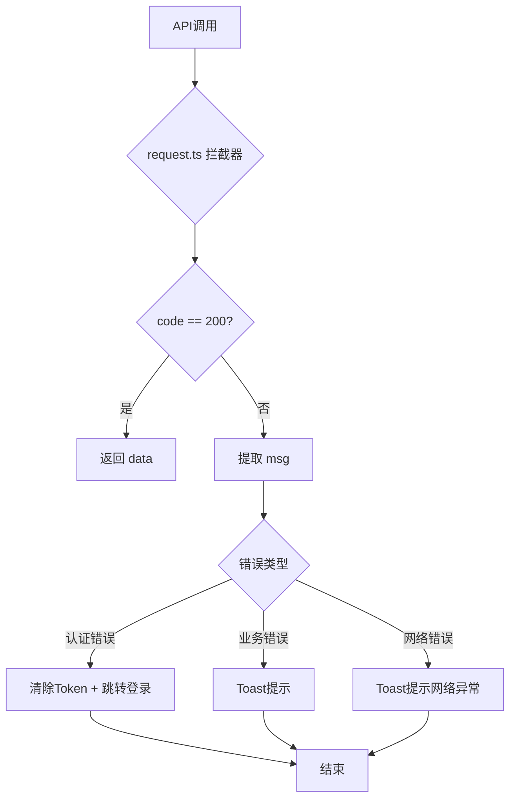
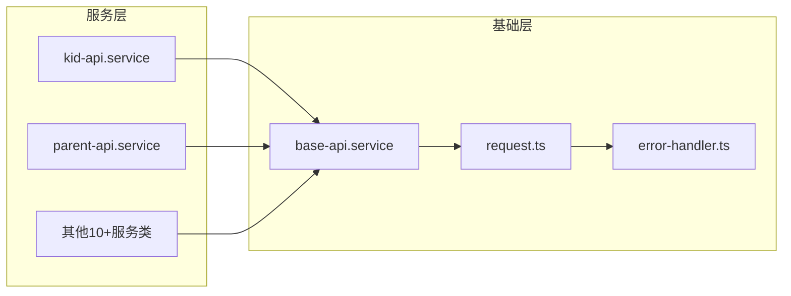

## 产品概述

统一前端 API 调用架构，将 base-api.service.ts 的底层实现从 Fetch 改为 Axios，并集成统一错误处理机制。

## 核心功能

1. **底层实现迁移**：base-api.service.ts 从 Fetch 改为调用 request.ts（Axios）
2. **统一错误处理**：创建统一错误处理器，所有错误消息由后端 msg 字段提供
3. **废弃冗余代码**：移除 core/network/api/*.api.ts（kid.api、parent.api、game.api）
4. **迁移调用方**：将 Store 层从 kidApi/parentApi 迁移到 kid-api.service/parent-api.service
5. **保持接口兼容**：10+ 个服务类无需修改，透明切换

## 改造范围

- 改造文件：base-api.service.ts、request.ts、core/store/kid.ts、core/store/parent.ts
- 新增文件：utils/error-handler.ts
- 废弃文件：core/network/api/*.api.ts（4个文件）

## Tech Stack

- 语言：TypeScript
- HTTP客户端：Axios（已引入）
- 状态管理：Pinia
- UI提示：Toast组件

## Implementation Approach

### 改造策略

采用"中间层改造"策略，最小化改动范围：

1. base-api.service.ts 内部改为调用 request.ts
2. 对外接口完全不变，10+个服务类无需修改
3. request.ts 集成统一错误处理器

### 改造前后对比

```
改造前：
┌─────────────────┐     ┌─────────────────┐
│  kid-api.service │────▶│ base-api.service │────▶ Fetch API
│ (10+ 服务类)     │     │   (Fetch 实现)   │
└─────────────────┘     └─────────────────┘
                        
┌─────────────────┐     ┌─────────────────┐
│  core/store/*   │────▶│ network/api/*   │────▶ request.ts (Axios)
└─────────────────┘     └─────────────────┘

改造后：
┌─────────────────┐     ┌─────────────────┐     ┌─────────────────┐
│  kid-api.service │────▶│ base-api.service │────▶│ request.ts      │
│ (10+ 服务类)     │     │ (Axios 适配层)   │     │ (Axios + 错误处理)│
└─────────────────┘     └─────────────────┘     └─────────────────┘

┌─────────────────┐     ┌─────────────────┐
│  core/store/*   │────▶│ kid-api.service │（迁移）
└─────────────────┘     └─────────────────┘
```

## Architecture Design

### 错误处理流程



### 文件依赖关系



## Directory Structure

### 文件变更清单

```
kids-game-frontend/src/
├── services/
│   ├── base-api.service.ts          # [MODIFY] 核心：Fetch → Axios，内部调用 request.ts
│   └── *-api.service.ts             # [无需修改] 10+个服务类保持不变
├── core/
│   ├── network/
│   │   ├── request.ts               # [MODIFY] 集成统一错误处理器
│   │   └── api/                     # [DELETE] 整个目录废弃
│   │       ├── index.ts             # [DELETE]
│   │       ├── kid.api.ts           # [DELETE]
│   │       ├── parent.api.ts        # [DELETE]
│   │       └── game.api.ts          # [DELETE]
│   └── store/
│       ├── kid.ts                   # [MODIFY] kidApi → kid-api.service
│       └── parent.ts                # [MODIFY] parentApi → parent-api.service
└── utils/
    └── error-handler.ts             # [NEW] 统一错误处理器
```

### 关键实现说明

#### 1. base-api.service.ts 改造

```typescript
// 改造前：使用 Fetch
protected async request<T>(url: string, options: RequestInit): Promise<ApiResponse<T>> {
  const response = await fetch(`${this.baseUrl}${url}`, options);
  // ... Fetch 处理逻辑
}

// 改造后：使用 request.ts（Axios）
import { request } from '@/core/network/request';

protected async request<T>(url: string, options: RequestOptions): Promise<ApiResponse<T>> {
  const config: RequestOptions = {
    url: `${this.baseUrl}${url}`,
    method: options.method || 'GET',
    data: options.body ? JSON.parse(options.body as string) : undefined,
    headers: this.buildHeaders(options.headers),
    skipErrorHandler: options.skipErrorHandler,  // 支持跳过错误处理
  };
  return request.request<T>(config);
}
```

#### 2. request.ts 集成错误处理器

```typescript
// 响应拦截器改造
this.instance.interceptors.response.use(
  (response: AxiosResponse<ApiResponse>) => {
    const { data } = response;
    if (data.code === 200) {
      return data;
    } else {
      // 使用统一错误处理器
      handleError(data.code, data.msg, response.config);
      return Promise.reject(new Error(data.msg));
    }
  },
  (error) => {
    // 网络错误处理
    handleNetworkError(error);
    return Promise.reject(error);
  }
);
```

#### 3. error-handler.ts 错误处理器

```typescript
// 错误类型枚举
enum ErrorType {
  BUSINESS = 'business',      // 业务错误
  AUTH = 'auth',              // 认证错误
  PERMISSION = 'permission',  // 权限错误
  NETWORK = 'network',        // 网络错误
  SYSTEM = 'system',          // 系统错误
}

// 统一错误处理函数
function handleError(code: number, msg: string, config: any): void {
  // 支持配置跳过自动处理
  if (config?.skipErrorHandler) return;
  
  const errorType = classifyError(code);
  switch (errorType) {
    case ErrorType.AUTH:
      handleAuthError(msg);
      break;
    default:
      showToast(msg);
  }
}
```

## Implementation Notes

- **兼容性**：所有服务类无需修改，base-api.service.ts 保持相同的方法签名
- **Token管理**：request.ts 已支持 authToken/parentToken 优先级，base-api.service.ts 中的 token 管理可复用
- **错误分类**：参考后端 ErrorCode.java 的错误码范围（1000-1999业务、2001-2999认证等）
- **渐进式迁移**：Store 层迁移可以先完成核心改造后再进行

## Agent Extensions

### SubAgent

- **code-explorer**
- Purpose: 搜索所有使用 kidApi/parentApi/gameApi 的调用点，确保迁移完整
- Expected outcome: 生成完整的调用点列表，确认无遗漏