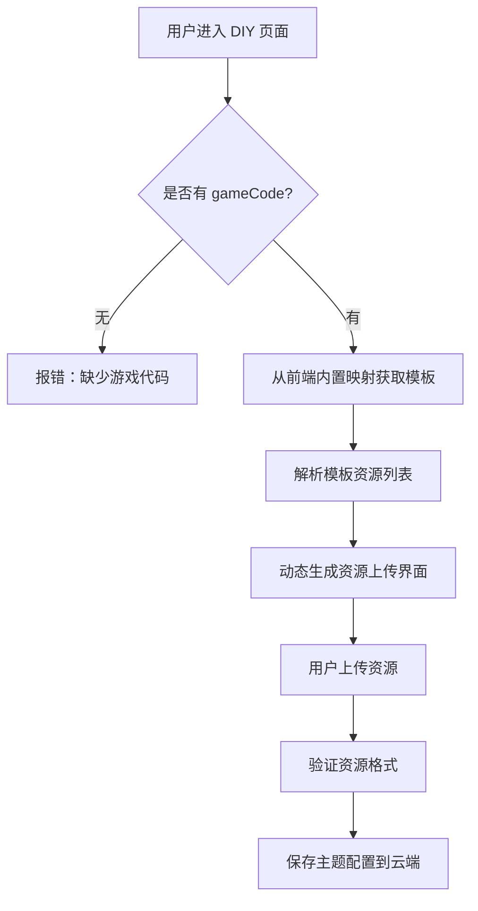

# 创作者中心 DIY 页面架构设计

## 核心理念

**通用的主题创作功能页面，不为特定游戏定制，完全由游戏模板驱动**

## DIY 功能场景

### 场景 1：基于官方主题修改（主要场景）
```
用户进入创作者中心 
→ 选择“官方主题”标签
→ 选择一个主题（如“贪吃蛇 - 经典复古”）
→ 点击"DIY"按钮
→ ⭐ 跳转：/theme-diy?themeId=123&gameCode=snake-vue3&baseThemeName=...
→ 从数据库 API 加载主题详情：/api/theme/123
→ ⭐ 从主题数据中获取 gameCode
→ 解析 config_json，填充所有表单和资源
→ 用户修改资源、颜色等
→ 保存为自己的新主题
```

### 场景 2：基于自己已上传的主题修改
```
用户进入创作者中心
→ 选择“我的主题”标签
→ 点击某个已上传的主题的“编辑”按钮
→ ⭐ 跳转：/theme-diy?themeId=456&gameCode=snake-vue3
→ 从数据库 API 加载主题详情：/api/theme/456
→ ⭐ 从主题数据中获取 gameCode
→ 加载完整配置
→ 修改后保存
```

### 场景 3：创建全新主题（未来扩展）
```
用户进入创作者中心
→ 点击“创建新主题”按钮
→ 跳转到 /theme-diy?gameCode=snake-vue3
→ 显示空模板或默认配置
→ 用户上传所有资源
→ 保存为新主题
```

## 架构设计

### 1. 前端内置游戏资源模板映射

**核心思想：每个游戏的资源类型是固定的，不需要动态配置**

在 DIY 页面中内置已知游戏的资源模板映射：

```typescript
const GAME_THEME_TEMPLATES: Record<string, any> = {
  'snake-vue3': {
    resources: {
      images: {
        snakeHead: { label: '蛇头图片', required: true, specs: { width: 64 } },
        snakeBody: { label: '蛇身图片', required: true },
        food: { label: '食物图片', required: true }
      },
      audio: {
        eat: { label: '吃东西音效', required: true },
        die: { label: '死亡音效', required: true }
      }
    }
  },
  'plants-vs-zombie': {
    resources: {
      images: {
        player: { label: '玩家角色', required: true },
        enemy: { label: '敌人角色', required: true },
        projectile: { label: '投射物', required: true }
      },
      audio: {
        shoot: { label: '射击音效', required: true },
        hit: { label: '击中音效', required: true }
      }
    }
  }
};
```

**优势：**
- ✅ 简单直接，无需后端支持
- ✅ 类型安全，编译时检查
- ✅ 性能好，无网络请求
- ✅ 易于维护和调试

```json
{
  "version": "1.0.0",
  "gameCode": "snake-vue3",
  "gameName": "贪吃蛇大冒险",
  "resources": {
    "images": {
      "snakeHead": {
        "label": "蛇头图片",
        "description": "贪吃蛇的头部形象",
        "required": true,
        "specs": {
          "width": 64,
          "height": 64,
          "format": ["png", "webp"],
          "transparent": true,
          "maxSize": 500
        }
      },
      "food": {
        "label": "食物图片",
        "description": "贪吃蛇的食物",
        "required": true,
        "specs": {
          "width": 32,
          "height": 32,
          "format": ["png", "webp"]
        }
      }
    },
    "audio": {
      "eat": {
        "label": "吃东西音效",
        "required": true,
        "specs": {
          "format": ["mp3", "wav"],
          "duration": "0.5-2"
        }
      }
    }
  }
}
```

### 2. DIY 页面通用化处理流程



### 3. 数据结构统一

#### 前端提交格式
```typescript
interface DiyThemeData {
  baseThemeKey: string;
  name: string;
  author: string;
  description?: string;
  assetOverrides: {
    snakeHead: "data:image/png;base64,..."  // 游戏定义的资源键
    food: "data:image/png;base64,..."
  };
  styleOverrides: {
    color_primary: "#ff6600"
  };
}
```

#### 后端存储格式（config_json）
```json
{
  "default": {
    "name": "活力橙",
    "author": "官方团队",
    "description": "充满活力的橙色主题",
    "styles": {
      "colors": {
        "primary": "#ff6600"
      }
    },
    "assets": {
      "snakeHead": {
        "type": "image",
        "url": "http://localhost:5173/games/snake-vue3/themes/orange/images/snakeHead.png"
      },
      "food": {
        "type": "image",
        "url": "http://localhost:5173/games/snake-vue3/themes/orange/images/food.png"
      }
    }
  }
}
```

### 4. 关键实现细节

#### 动态加载模板（从前端内置映射）
```typescript
// ThemeDIYPage.vue 中定义
const GAME_THEME_TEMPLATES: Record<string, any> = {
  'snake-vue3': { ... },
  'plants-vs-zombie': { ... }
};

async function getGameAssetConfig(code: string): Promise<GameAssetConfig | null> {
  if (!code) return null;
  
  // 直接从内置映射获取
  const template = GAME_THEME_TEMPLATES[code];
  
  if (template) {
    console.log(`[ThemeDIY] 使用内置模板：${template.gameName}`);
    return {
      gameCode: template.gameCode,
      gameName: template.gameName,
      template: template
    };
  }
  
  // 如果内置映射没有，可以尝试从后端 API 获取（未来扩展）
  try {
    const apiUrl = `/api/game/theme-template?gameCode=${code}`;
    const response = await fetch(apiUrl);
    if (response.ok) {
      const result = await response.json();
      if (result.code === 200 && result.data) {
        return { gameCode: result.data.gameCode, gameName: result.data.gameName, template: result.data };
      }
    }
  } catch (error) {
    // 忽略 API 错误
  }
  
  console.warn(`未找到游戏 ${code} 的模板，使用默认配置`);
  return { gameCode: code, gameName: code };
}
```

#### 动态生成资源列表
```typescript
// 根据模板动态获取图片资源键
const imageAssetKeys = computed(() => {
  if (!themeTemplate.value?.resources.images) {
    console.warn('没有图片资源配置');
    return [];
  }
  return Object.keys(themeTemplate.value.resources.images);
});

// 根据模板动态获取音频资源键
const audioAssetKeys = computed(() => {
  if (!themeTemplate.value?.resources.audio) {
    console.warn('没有音频资源配置');
    return [];
  }
  return Object.keys(themeTemplate.value.resources.audio);
});
```

#### 资源验证
```typescript
function handleAssetUpload(key: string, event: Event): void {
  const input = event.target as HTMLInputElement;
  const file = input.files?.[0];
  if (!file) return;

  // 从模板获取资源配置
  const config = getImageAssetConfig(key) || getAudioAssetConfig(key);
  if (config) {
    const validation = validateResource(key, file, config);
    if (!validation.valid) {
      alert(validation.error || '资源验证失败');
      input.value = '';
      return;
    }
    if (validation.warning) {
      console.warn(validation.warning);
    }
  }

  const reader = new FileReader();
  reader.onload = (e) => {
    themeAssets[key] = e.target?.result as string;
  };
  reader.readAsDataURL(file);
}
```

## 优势

### 1. **完全解耦**
- DIY 页面不依赖任何游戏的特定代码
- 新增游戏只需添加模板文件，无需修改 DIY 页面

### 2. **高度灵活**
- 每个游戏可以定义完全不同的资源类型
- 支持自定义资源规格（尺寸、格式、时长等）

### 3. **易于扩展**
- 新增资源类型：在模板中添加配置即可
- 支持新的游戏类型：不需要修改前端代码

### 4. **数据一致性**
- 前端上传的资源键 = 后端存储的资源键 = 游戏使用的资源键
- 避免了转换层，减少出错可能

## 游戏接入流程

### 步骤 1：在前端 DIY 页面添加游戏模板
在 `ThemeDIYPage.vue` 的 `GAME_THEME_TEMPLATES` 中添加新游戏的资源配置

### 步骤 2：定义所需资源
根据游戏特点定义需要的图片和音频资源及其规格

### 步骤 3：在游戏中使用主题资源
```typescript
// 游戏侧通过主题管理器加载主题
const theme = await themeManager.getGameThemes(gameCode);
const snakeHeadImage = theme.assets.snakeHead;
const foodImage = theme.assets.food;
```

### 步骤 4：测试验证
从创作者中心选择该游戏，进入 DIY 页面，验证资源列表是否正确显示

## 错误处理

### 场景 1：缺少 gameCode 参数
```typescript
if (!gameCode.value) {
  console.error('[ThemeDIY] 缺少游戏代码参数');
  alert('错误：缺少游戏代码 (gameCode)，请从创作者中心选择游戏后进入');
  router.push('/creator-center');
  return;
}
```

### 场景 2：模板文件不存在
```typescript
try {
  const response = await fetch(templateUrl);
  if (!response.ok) {
    throw new Error(`模板文件不存在：${templateUrl}`);
  }
} catch (error) {
  console.error('[ThemeDIY] 加载模板失败:', error);
  alert('该游戏暂不支持主题创作，请重试或联系管理员');
}
```

## 总结

通过**模板驱动 + 动态加载**的设计，实现了：
- ✅ DIY 页面完全通用化
- ✅ 游戏资源自定义
- ✅ 零耦合集成
- ✅ 易于维护和扩展

这才是正确的架构设计！
