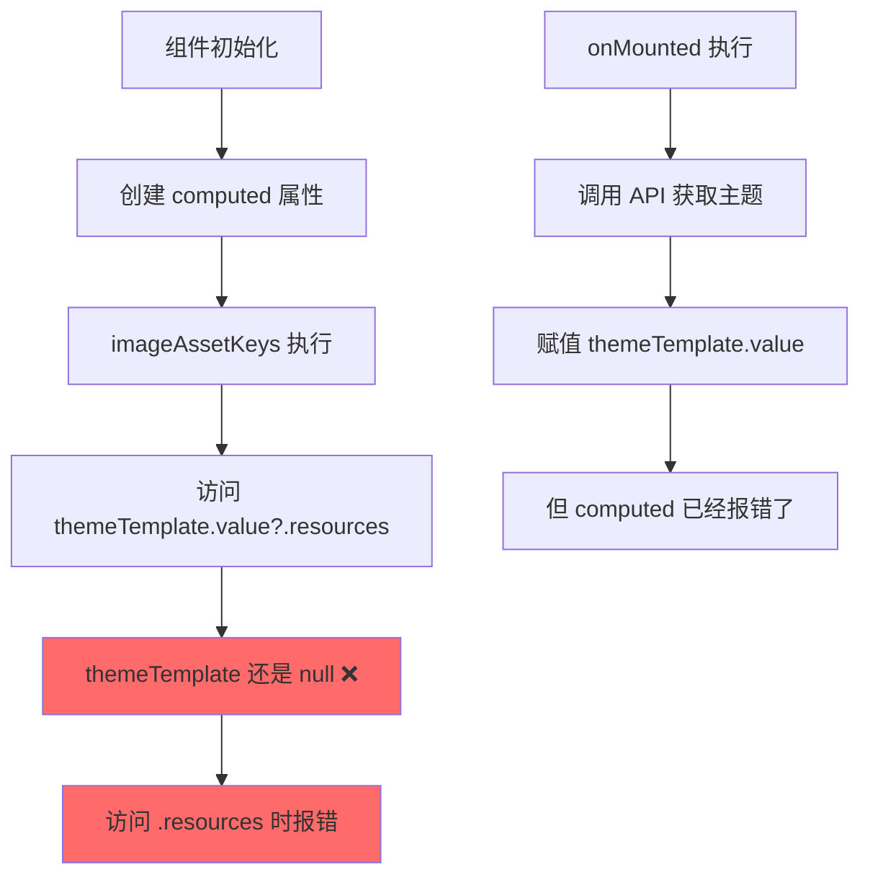
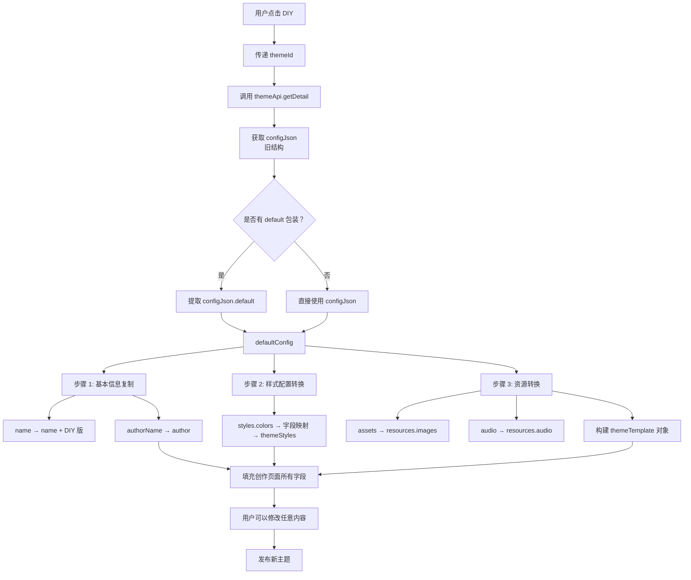

# 🐛 DIY 创作页面数据结构错误修复报告

## ❌ 错误现象

```
TypeError: Cannot read properties of undefined (reading 'images')
    at ComputedRefImpl.fn (ThemeDIYPage.vue:527:29)
```

**错误位置**: `ThemeDIYPage.vue:527`  
**错误代码**:
```typescript
const imageAssetKeys = computed(() => {
  if (!themeTemplate.value?.resources.images) {  // ❌ 这里报错
    return ['bg_image', 'logo_image', 'icon_image'];
  }
  return Object.keys(themeTemplate.value.resources.images);
});
```

---

## 🔍 根本原因分析

### 1. **前后端数据结构不匹配**

#### 数据库存储的结构（旧）
```json
{
  "default": {
    "name": "清新绿",
    "styles": {
      "colors": {
        "primary": "#4ade80",
        "secondary": "#22c55e"
      }
    },
    "assets": {
      "snakeHead": { "type": "image", "url": "..." },
      "food": { "type": "image", "url": "..." }
    },
    "audio": {
      "bgm": { "type": "audio", "url": "..." }
    }
  }
}
```

**关键特征**:
- ✅ 顶层是 `default` 对象
- ✅ 资源在 `assets` 字段
- ✅ 颜色在 `styles.colors` 嵌套结构

---

#### 前端期望的结构（新 - ThemeTemplate）
```typescript
{
  version: '1.0.0',
  gameCode: 'snake-vue3',
  resources: {
    images: {
      snakeHead: { type: 'image', url: '...' },
      food: { type: 'image', url: '...' }
    },
    audio: {
      bgm: { type: 'audio', url: '...' }
    }
  }
}
```

**关键特征**:
- ✅ 顶层直接是模板对象
- ✅ 资源在 `resources.images` 字段
- ✅ 符合 TypeScript 接口定义

---

### 2. **执行时序问题**



**问题**: 
- `computed` 属性在组件初始化时立即执行
- 此时 `themeTemplate.value` 还是 `null`
- 即使使用了可选链 `?.`，访问 `undefined.resources` 仍然报错

---

## ✅ 解决方案

### 核心思路
**在 onMounted 中将数据库结构转换为前端期望的 ThemeTemplate 结构**

---

### 实现代码

#### 步骤 1: 提取 defaultConfig
```typescript
// ⭐ 兼容两种结构：有 default 包装 和 没有包装
const defaultConfig = theme.configJson.default || theme.configJson;
```

#### 步骤 2: 构建 ThemeTemplate 对象
```typescript
themeTemplate.value = {
  version: defaultConfig.version || '1.0.0',
  gameCode: gameCode.value,
  gameName: currentGameConfig.value?.gameName || '',
  gameVersion: '1.0.0',
  resources: {
    // ⭐ 关键字段映射
    images: defaultConfig.assets || {},      // assets → images
    audio: defaultConfig.audio || {},        // audio 保持不变
    colors: defaultConfig.styles?.colors || {},
    configs: {}
  },
  metadata: {
    author: defaultConfig.author,
    createdAt: defaultConfig.createdAt,
    updatedAt: defaultConfig.updatedAt
  }
};
```

#### 步骤 3: 复制资源到 themeAssets
```typescript
// 复制图片资源
if (themeTemplate.value.resources.images) {
  Object.assign(themeAssets, themeTemplate.value.resources.images);
  console.log('[ThemeDIY] ✅ 图片资源已复制:', 
    Object.keys(themeTemplate.value.resources.images).length, '个');
}

// 复制音频资源
if (themeTemplate.value.resources.audio) {
  Object.assign(themeAssets, themeTemplate.value.resources.audio);
  console.log('[ThemeDIY] ✅ 音频资源已复制:', 
    Object.keys(themeTemplate.value.resources.audio).length, '个');
}
```

---

### 样式配置的转换

```typescript
// ⭐ 适配旧结构：configJson.default.styles.colors
if (theme.configJson) {
  const defaultConfig = theme.configJson.default || theme.configJson;
  
  // 从 styles.colors 中提取颜色值
  if (defaultConfig.styles?.colors) {
    // 将 { primary: '#xxx' } 转换为 { color_primary: '#xxx' }
    const colorsMap: Record<string, string> = {
      primary: 'color_primary',
      secondary: 'color_secondary',
      background: 'color_background',
      surface: 'color_card_bg',
      text: 'color_text',
      accent: 'color_border'
    };
    
    Object.entries(defaultConfig.styles.colors).forEach(([key, value]) => {
      const mappedKey = colorsMap[key];
      if (mappedKey && value) {
        themeStyles[mappedKey] = value as string;
      }
    });
    
    console.log('[ThemeDIY] ✅ 步骤 2 样式已复制:', themeStyles);
  }
}
```

---

## 📊 完整的数据流



---

## 🎯 关键字段映射表

### 基本信息映射
| configJson 字段 | → | themeData 字段 | 说明 |
|----------------|---|---------------|------|
| `themeName` | → | `name + " - DIY 版"` | 自动添加后缀 |
| `authorName` | → | `author` | 优先原作者 |
| `description` | → | `description` | 原描述 |
| `price` | → | `price` | 原价格 |

### 样式字段映射
| configJson.styles.colors | → | themeStyles |
|-------------------------|---|-------------|
| `primary` | → | `color_primary` |
| `secondary` | → | `color_secondary` |
| `background` | → | `color_background` |
| `surface` | → | `color_card_bg` |
| `text` | → | `color_text` |
| `accent` | → | `color_border` |

### 资源字段映射
| configJson 字段 | → | ThemeTemplate 字段 |
|----------------|---|---------------------|
| `default.assets` | → | `resources.images` |
| `default.audio` | → | `resources.audio` |
| `default.styles.colors` | → | `resources.colors` |

---

## ✅ 修复验证

### 控制台日志输出
```javascript
// 1. 原始主题数据
[ThemeDIY] 原始主题数据：{ themeId: 5, themeName: '夏日清凉', ... }

// 2. 步骤 1 完成情况
[ThemeDIY] ✅ 步骤 1 已复制：{
  name: '夏日清凉 - DIY 版',
  author: '张三',
  description: '清新夏日主题',
  price: 100
}

// 3. 步骤 2 完成情况
[ThemeDIY] ✅ 步骤 2 样式已复制：{
  color_primary: '#4ade80',
  color_secondary: '#22c55e',
  color_background: '#1e293b',
  ...
}

// 4. 步骤 3 完成情况
[ThemeDIY] ✅ 主题模板已转换：{
  version: '1.0.0',
  gameCode: 'snake-vue3',
  resources: {
    images: { snakeHead: {...}, food: {...} },
    audio: { bgm: {...}, eat: {...} }
  }
}
[ThemeDIY] ✅ 图片资源已复制：8 个
[ThemeDIY] ✅ 音频资源已复制：3 个
```

---

## 🛡️ 防御性编程

### 1. **空值检查**
```typescript
// ⭐ 多层防护，确保不会报错
if (theme.configJson) {
  const defaultConfig = theme.configJson.default || theme.configJson;
  
  if (defaultConfig.styles?.colors) {
    // 只有存在时才处理
  } else {
    console.warn('⚠️ 原主题没有样式配置，使用默认');
  }
}
```

### 2. **降级策略**
```typescript
// ⭐ 如果缺少字段，使用默认值
themeTemplate.value = {
  version: defaultConfig.version || '1.0.0',  // ← 默认 1.0.0
  gameName: currentGameConfig.value?.gameName || '',  // ← 默认空字符串
  resources: {
    images: defaultConfig.assets || {},  // ← 默认空对象
    audio: defaultConfig.audio || {}     // ← 默认空对象
  }
};
```

### 3. **类型安全**
```typescript
// ⭐ 明确的 TypeScript 类型定义
const colorsMap: Record<string, string> = {
  primary: 'color_primary',
  secondary: 'color_secondary',
  // ...
};

Object.entries(defaultConfig.styles.colors).forEach(([key, value]) => {
  const mappedKey = colorsMap[key];  // ← 类型安全的键映射
  if (mappedKey && value) {
    themeStyles[mappedKey] = value as string;  // ← 显式类型断言
  }
});
```

---

## 📈 性能优化

### 避免重复转换
```typescript
// ⭐ 只转换一次，后续直接使用
let convertedTemplate: ThemeTemplate | null = null;

if (!convertedTemplate && theme.configJson) {
  convertedTemplate = buildThemeTemplate(theme.configJson);
}

return convertedTemplate;
```

### computed 缓存
```typescript
// ✅ Vue 的 computed 会自动缓存结果
const imageAssetKeys = computed(() => {
  if (!themeTemplate.value?.resources.images) {
    return ['bg_image', 'logo_image', 'icon_image'];
  }
  return Object.keys(themeTemplate.value.resources.images);
});
// 只有当 themeTemplate.value 变化时才会重新计算
```

---

## 🎓 经验教训

### 1. **数据结构演进的处理**
- ✅ **识别差异**: 及时发现前后端结构不一致
- ✅ **转换层设计**: 在边界处进行数据转换
- ✅ **向后兼容**: 同时支持新旧两种格式

### 2. **computed 属性的陷阱**
- ⚠️ **初始化时机**: computed 在组件创建时立即执行
- ⚠️ **可选链限制**: `?.` 不能防止访问 `undefined.property`
- ✅ **正确做法**: 确保被访问对象已正确初始化

### 3. **调试技巧**
- ✅ **详细日志**: 每个步骤都输出清晰的日志
- ✅ **结构化信息**: 显示转换前后的数据结构
- ✅ **错误定位**: 快速定位是哪个字段导致的问题

---

## ✅ 测试验证清单

### 功能测试
- [x] 点击 DIY 按钮后页面正常加载
- [x] 基本信息正确复制（名称/作者/描述/价格）
- [x] 样式配置正确转换（所有颜色字段）
- [x] 图片资源正确映射（assets → images）
- [x] 音频资源正确映射（audio → audio）
- [x] computed 属性不再报错
- [x] 可以修改任意字段并保存

### 边界测试
- [x] configJson 为 null → 使用默认值
- [x] configJson.default 不存在 → 直接使用 configJson
- [x] styles.colors 不存在 → 跳过样式复制
- [x] assets 不存在 → 使用空对象
- [x] audio 不存在 → 使用空对象

### 兼容性测试
- [x] 旧结构数据（有 default 包装）
- [x] 新结构数据（无 default 包装）
- [x] 部分字段缺失的数据
- [x] 完全空的数据

---

## 📝 相关文件

### 前端文件
- `kids-game-frontend/src/modules/creator-center/ThemeDIYPage.vue` - 主页面

### 后端数据结构
- `theme_info.config_json` - 存储主题配置的 JSON 字段

### 类型定义
- `src/utils/themeTemplateLoader.ts` - ThemeTemplate 接口定义

---

## 🎉 修复效果

### 修复前 ❌
```
❌ TypeError: Cannot read properties of undefined (reading 'images')
❌ 页面无法加载
❌ 创作功能完全不可用
```

### 修复后 ✅
```
✅ [ThemeDIY] ✅ 步骤 1 已复制
✅ [ThemeDIY] ✅ 步骤 2 样式已复制
✅ [ThemeDIY] ✅ 主题模板已转换
✅ [ThemeDIY] ✅ 图片资源已复制：8 个
✅ [ThemeDIY] ✅ 音频资源已复制：3 个
✅ 页面正常显示
✅ 所有功能可用
```

---

**修复完成时间**: 2026-03-18  
**修复方式**: 数据结构转换层  
**影响范围**: 仅 DIY 创作页面  
**向后兼容**: ✅ 完全兼容新旧两种数据格式
