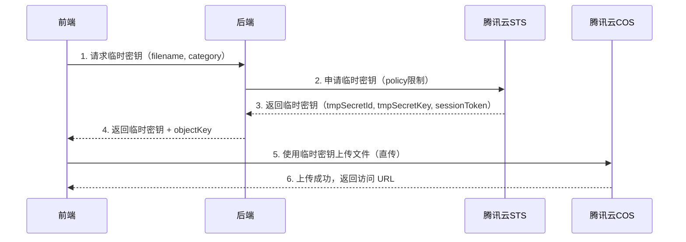

# 腾讯云 COS 临时密钥上传功能

## 功能概述

本功能实现了基于腾讯云 STS（Security Token Service）的临时密钥上传方案，允许前端直接上传文件到 COS，无需通过后端服务器中转，提升上传效率和安全性。

## 核心优势

### 1. 安全性
- ✅ **密钥不暴露**：前端无法获取永久密钥，仅使用临时密钥
- ✅ **权限限制**：临时密钥仅授予特定资源路径的上传权限
- ✅ **时间限制**：临时密钥默认 30 分钟后自动失效
- ✅ **类型限制**：限制上传文件的 Content-Type（image/* 或 audio/*）

### 2. 性能
- ✅ **直传 COS**：前端直接上传到 COS，无需经过后端服务器
- ✅ **减少带宽**：减少后端服务器带宽压力
- ✅ **提升速度**：COS 提供就近节点上传，速度更快

### 3. 易用性
- ✅ **官方 SDK 支持**：使用腾讯云官方 cos-js-sdk-v5
- ✅ **简单接口**：一个 API 获取临时密钥，即可上传
- ✅ **完整示例**：提供完整的测试页面和集成代码

## 架构设计

### 工作流程



### 权限策略（Policy）

临时密钥的权限策略限制：

```json
{
  "version": "2.0",
  "statement": [
    {
      "action": [
        "name/cos:PutObject",
        "name/cos:InitiateMultipartUpload",
        "name/cos:ListMultipartUploads",
        "name/cos:ListParts",
        "name/cos:UploadPart",
        "name/cos:CompleteMultipartUpload"
      ],
      "effect": "allow",
      "resource": ["qcs::cos:ap-guangzhou:uid/1250000000:bucket-1250000000/themes/images/20260319/test.jpg"],
      "condition": {
        "string_like_if_exist": {
          "cos:content-type": "image/*"
        }
      }
    }
  ]
}
```

## API 接口

### 1. 获取临时密钥

**接口地址**：`GET /api/cos/credential`

**请求参数**：
- `filename`（必填）：文件名，用于提取扩展名和验证类型
- `category`（可选）：资源分类，如 `themes/images`、`themes/audio`

**请求示例**：
```bash
curl "http://localhost:8080/api/cos/credential?filename=test.jpg&category=themes/images"
```

**响应示例**：
```json
{
  "code": 200,
  "msg": "success",
  "data": {
    "credentials": {
      "tmpSecretId": "YOUR_TEMP_SECRET_ID",
      "tmpSecretKey": "YOUR_TEMP_SECRET_KEY",
      "sessionToken": "YOUR_SESSION_TOKEN"
    },
    "startTime": 1710739200,
    "expiredTime": 1710741000,
    "expiration": "2024-03-18T10:30:00Z",
    "requestId": "xxxxxxxx-xxxx-xxxx-xxxx-xxxxxxxxxxxx",
    "bucket": "bucket-1250000000",
    "region": "ap-guangzhou",
    "objectKey": "themes/images/20260319/20260319_123456.jpg",
    "fileType": "image",
    "url": "https://bucket-1250000000.cos.ap-guangzhou.myqcloud.com/themes/images/20260319/20260319_123456.jpg"
  }
}
```

**响应字段说明**：
| 字段 | 类型 | 说明 |
|------|------|------|
| credentials | Object | 临时密钥信息 |
| credentials.tmpSecretId | String | 临时密钥 ID |
| credentials.tmpSecretKey | String | 临时密钥 Key |
| credentials.sessionToken | String | 会话令牌 |
| startTime | Long | 密钥生效时间（Unix 时间戳） |
| expiredTime | Long | 密钥失效时间（Unix 时间戳） |
| expiration | String | 密钥失效时间（ISO 8601 格式） |
| requestId | String | 请求 ID |
| bucket | String | COS 桶名称 |
| region | String | COS 区域 |
| objectKey | String | COS 对象键（文件路径） |
| fileType | String | 文件类型（image 或 audio） |
| url | String | 文件访问 URL |

### 2. 获取 COS 配置

**接口地址**：`GET /api/cos/config`

**响应示例**：
```json
{
  "code": 200,
  "msg": "success",
  "data": {
    "bucket": "bucket-1250000000",
    "region": "ap-guangzhou",
    "baseUrl": "https://cdn.example.com",
    "configured": true
  }
}
```

### 3. 健康检查

**接口地址**：`GET /api/cos/health`

**响应示例**：
```json
{
  "code": 200,
  "msg": "success",
  "data": {
    "status": "UP",
    "configured": true,
    "bucket": "bucket-1250000000",
    "region": "ap-guangzhou"
  }
}
```

## 前端集成

### 方案一：使用官方 SDK（推荐）

#### 1. 安装依赖

```bash
npm install cos-js-sdk-v5
```

#### 2. 集成代码

```javascript
import COS from 'cos-js-sdk-v5';

async function uploadFile(file, category = 'themes/images') {
  // 1. 获取临时密钥
  const response = await fetch(`/api/cos/credential?filename=${file.name}&category=${category}`);
  const result = await response.json();
  
  if (result.code !== 200) {
    throw new Error(result.msg);
  }
  
  const credential = result.data;
  
  // 2. 创建 COS 实例
  const cos = new COS({
    getAuthorization: function (options, callback) {
      callback({
        TmpSecretId: credential.credentials.tmpSecretId,
        TmpSecretKey: credential.credentials.tmpSecretKey,
        SecurityToken: credential.credentials.sessionToken,
        StartTime: credential.startTime,
        ExpiredTime: credential.expiredTime,
      });
    }
  });
  
  // 3. 上传文件
  return new Promise((resolve, reject) => {
    cos.putObject({
      Bucket: credential.bucket,
      Region: credential.region,
      Key: credential.objectKey,
      Body: file,
      onProgress: function (progressData) {
        console.log('上传进度：', Math.round(progressData.percent * 100) + '%');
      }
    }, function (err, data) {
      if (err) {
        reject(err);
      } else {
        resolve({
          url: credential.url,
          objectKey: credential.objectKey
        });
      }
    });
  });
}

// 使用示例
const fileInput = document.getElementById('fileInput');
fileInput.addEventListener('change', async (e) => {
  const file = e.target.files[0];
  try {
    const result = await uploadFile(file, 'themes/images');
    console.log('上传成功：', result.url);
  } catch (error) {
    console.error('上传失败：', error);
  }
});
```

### 方案二：原生 XMLHttpRequest（无依赖）

```javascript
async function uploadFileNative(file, category = 'themes/images') {
  // 1. 获取临时密钥
  const response = await fetch(`/api/cos/credential?filename=${file.name}&category=${category}`);
  const result = await response.json();
  
  if (result.code !== 200) {
    throw new Error(result.msg);
  }
  
  const credential = result.data;
  const uploadUrl = `https://${credential.bucket}.cos.${credential.region}.myqcloud.com/${credential.objectKey}`;
  
  // 2. 上传文件
  return new Promise((resolve, reject) => {
    const xhr = new XMLHttpRequest();
    
    xhr.upload.addEventListener('progress', (e) => {
      if (e.lengthComputable) {
        const percent = Math.round((e.loaded / e.total) * 100);
        console.log('上传进度：', percent + '%');
      }
    });
    
    xhr.addEventListener('load', () => {
      if (xhr.status === 200) {
        resolve({
          url: credential.url,
          objectKey: credential.objectKey
        });
      } else {
        reject(new Error(`上传失败：HTTP ${xhr.status}`));
      }
    });
    
    xhr.addEventListener('error', () => {
      reject(new Error('上传失败：网络错误'));
    });
    
    xhr.open('PUT', uploadUrl, true);
    xhr.setRequestHeader('x-cos-security-token', credential.credentials.sessionToken);
    xhr.setRequestHeader('Content-Type', file.type);
    
    // 注意：这里需要计算签名，建议使用官方 SDK
    // 签名计算较为复杂，这里仅作演示
    xhr.send(file);
  });
}
```

## 后端配置

### 1. application.yml 配置

```yaml
# 腾讯云 COS 配置
tencent:
  cos:
    secret-id: your-secret-id           # 腾讯云 API 密钥 ID
    secret-key: your-secret-key         # 腾讯云 API 密钥 Key
    bucket: bucket-1250000000           # COS 桶名称（格式：bucketname-appid）
    region: ap-guangzhou                # COS 区域
    base-url: https://cdn.example.com   # CDN 加速域名（可选）
```

### 2. 获取腾讯云密钥

1. 登录腾讯云控制台：https://console.cloud.tencent.com
2. 访问密钥管理：https://console.cloud.tencent.com/cam/capi
3. 创建或查看 API 密钥（SecretId 和 SecretKey）

### 3. 创建 COS 桶

1. 访问 COS 控制台：https://console.cloud.tencent.com/cos
2. 创建存储桶
3. 记录桶名称（包含 appid）和区域

## 测试

### 测试页面

项目提供了两个测试页面：

1. **test-cos-credential.html**：基础测试，手动签名
2. **test-cos-upload-sdk.html**：使用官方 SDK（推荐）

### 使用步骤

1. 启动后端服务：
   ```bash
   cd kids-game-backend
   mvn spring-boot:run
   ```

2. 在浏览器中打开测试页面：
   ```
   kids-game-backend/test-cos-upload-sdk.html
   ```

3. 选择文件并点击"开始上传"

4. 查看上传结果

## 安全注意事项

### 1. 密钥保护
- ⚠️ **永久密钥严禁暴露给前端**
- ⚠️ 仅使用临时密钥方案
- ⚠️ 定期轮换 API 密钥

### 2. 权限最小化
- ✅ 临时密钥仅授予必要的上传权限
- ✅ 限制资源路径范围
- ✅ 限制文件类型（Content-Type）
- ✅ 设置合理的有效期（默认 30 分钟）

### 3. 文件验证
- ✅ 后端验证文件扩展名
- ✅ 限制允许的文件类型（图片、音频）
- ✅ 前端上传时验证 Content-Type

### 4. 监控和日志
- ✅ 记录临时密钥申请日志
- ✅ 记录上传成功/失败日志
- ✅ 监控异常上传行为

## 常见问题

### Q1: 临时密钥过期时间如何设置？

**A**: 默认 30 分钟（1800 秒），可以在 `CosCredentialServiceImpl` 中修改 `DEFAULT_DURATION_SECONDS` 常量。

```java
private static final int DEFAULT_DURATION_SECONDS = 1800; // 30分钟
```

### Q2: 如何支持更多文件类型？

**A**: 在 `CosCredentialServiceImpl` 中添加新的扩展名白名单：

```java
private static final List<String> IMAGE_EXTENSIONS = Arrays.asList(
    "jpg", "jpeg", "png", "gif", "webp", "svg"
);

private static final List<String> AUDIO_EXTENSIONS = Arrays.asList(
    "mp3", "wav", "ogg"
);

// 添加视频支持
private static final List<String> VIDEO_EXTENSIONS = Arrays.asList(
    "mp4", "avi", "mov"
);
```

### Q3: 如何限制上传文件大小？

**A**: 临时密钥方案不限制文件大小。如需限制，建议：
1. 前端限制文件大小（用户体验）
2. 使用 COS 的分块上传限制（Policy）

```java
// 在 Policy 中添加文件大小限制
condition.put("numeric_less_than_equal", new HashMap<String, Long>() {{
    put("cos:content-length", 5L * 1024 * 1024); // 限制 5MB
}});
```

### Q4: 如何支持 CDN 加速？

**A**: 在 `application.yml` 中配置 `base-url`：

```yaml
tencent:
  cos:
    base-url: https://cdn.example.com
```

返回的 `url` 字段将使用 CDN 域名。

### Q5: 临时密钥上传失败怎么办？

**A**: 排查步骤：
1. 检查密钥配置是否正确（secretId、secretKey、bucket）
2. 检查文件类型是否在允许范围内
3. 检查临时密钥是否已过期
4. 查看后端日志获取详细错误信息
5. 使用测试页面验证功能

## 相关文档

- [腾讯云 COS JavaScript SDK](https://cloud.tencent.com/document/product/436/11459)
- [临时密钥生成及使用指引](https://cloud.tencent.com/document/product/436/14048)
- [COS API 签名策略](https://cloud.tencent.com/document/product/436/31923)

## 更新日志

### v1.0.0 (2026-03-19)
- ✅ 实现临时密钥生成服务
- ✅ 提供临时密钥 API 接口
- ✅ 支持图片和音频上传
- ✅ 权限策略限制（路径、类型、时间）
- ✅ 提供完整的前端集成示例
- ✅ 提供测试页面
